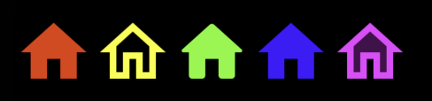

# react-native-material-icons

Google's Material Icons as SVG files. When only using a few icons, much more efficient to use the svg files. react-native-vector-icons did not have the fonts I needed. This also enables me to have a smaller application when I only need a handfull of icons (due to tree shaking).

```javascript
import { SvgHome, SvgHomeOutlined, SvgHomeRound, SvgHomeSharp, SvgHomeTwotone } from 'react-native-material-icons';

const Example = () => (
  <View style={{ flexDirection: 'row', backgroundColor: 'black' }}>
    <SvgHome size={48} color="#ff0000" />
    <SvgHomeOutlined size={48} color="#ffff00" />
    <SvgHomeRound size={48} color="#00ff00" />
    <SvgHomeSharp size={48} color="#0000ff" />
    <SvgHomeTwotone size={48} color="#ff00ff" />
  </View>
);
```



## Install

`yarn add react-native-material-icons react-native-svg`

## Search Google's [Material Icons](https://fonts.google.com/icons)

Search Google's [Material Icons](https://fonts.google.com/icons) list to see available svg files.

## Components

Names are mapped from google's website. The names map from snake case to PascalCase. All Icons are prefixed with `Svg`.

- `add_chart` becomes `<SvgAddChart />`
- `calendar_month` becomes `<SvgCalendarMonth />`
- `123` becomes `<Svg123 />`

## Properties

- `color`: light='#000000', dark='#ffffff'

  Color of icon in `#rrggbb` format. The default is based on Appearance.getColorScheme().

- `size`: Default is 24.

  Width and height of icon.

- `fillOpacity`: Default = 1

  This prop specifies the opacity of the color or the content the current object is filled with.
